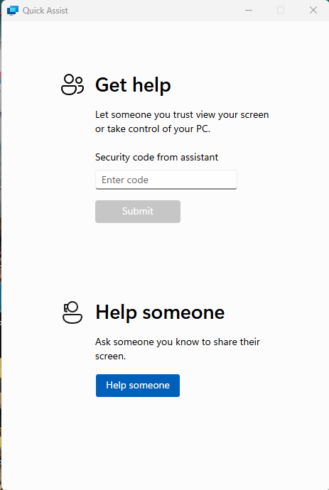
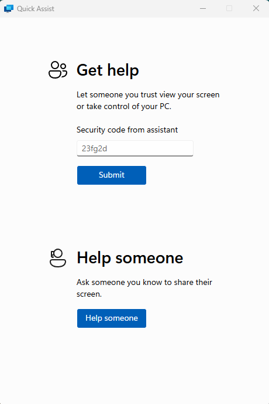
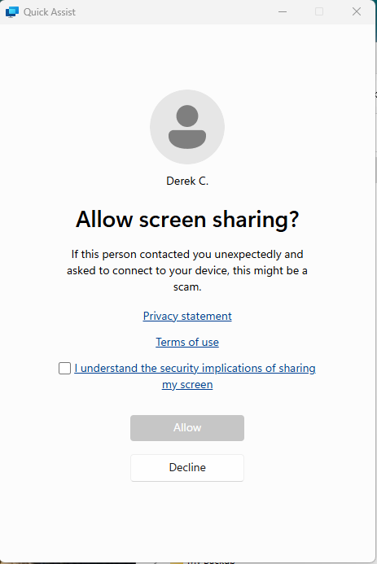
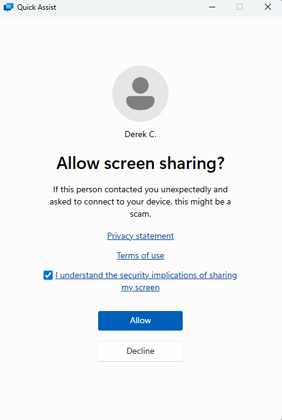
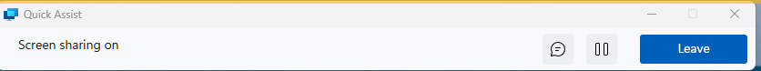

# Helping Remotely

I will use a program called **Quick Assist** to remotely access your computer.

To allow me to get access, you will need to follow the steps below:

## Start Quick Assist

- Go to the **Search** box at the *bottom of your screen*.
- Type in: **quick assist** and press *return*.

You will now see the **Quick Assist** App as shown below:

## Enter Access Code

I will give you an access code using WhatsApp.

Please enter this code into the box on the *Quick Assist* App, where it says **Enter Code**.  

Then click the **Submit** button.

See the example below:

## Allow Screen Sharing

You must now allow me to access your laptop.

You will see a box like the one below.

To proceed you must **click** the box to tick that you *understand the security implications*, as below:

Finally, you must then click the **Allow** button to proceed.

## Screen Sharing Enabled

I will now be able to see your screen.

You will see a box appear at the top of your screen, as below:

## Allowing Remote Control

By default, I can only **view** your screen, I can not **control** it.

In order to fix problems I will likely need to *request remote control*.

When I do this, you will see the box at the top of screen present two buttons, as below:

To give me control, you must click the **Allow** button as shown below:

Once I have remote control, the top box will display a message like the one below:

I will then be able to do things to your laptop.

## Ending Remote Assistance

I will most likely end the remote help from my end.

If I do not, or if we get disconnected - you can click the **Leave** button from the box at the top of the screen.

## More information

The [Microsoft Page](https://support.microsoft.com/en-us/windows/solve-pc-problems-remotely-with-remote-assistance-cf384ff4-6269-d86e-bcfe-92d72ed55922) about Remote Assist.

